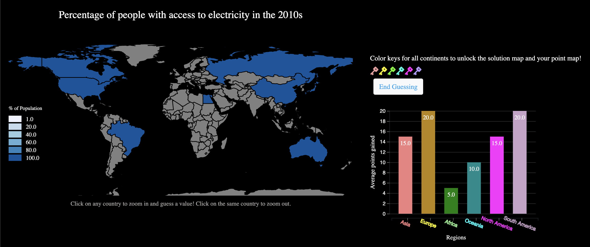

# Bird's Eye View

Team member: Charvi Gopal (charvig), Eesam Hourani (ehourani), Stacia Johanna (staciaj)

## Abstract
TODO

## Project links
Link to data visualization: https://6859-sp21.github.io/final-project-birds-eye-view/

Link to paper: TODO

Link to video trailer: https://www.youtube.com/watch?v=1fcNEe9il_s&feature=youtu.be&ab_channel=CharviG

## Running instructions
Go to https://6859-sp21.github.io/final-project-birds-eye-view/ and follow the instructions there. Laptop/PC recommended.

## Work breakdown
### Charvi Gopal
Map-specific logic for guessing game, point breakdown map, some manual data entry

### Eesam Hourani
TODO Eesam

### Stacia Johanna
Data cleaning, scrollytelling, all components of website story flow/logic and styling, category and decade form, styling and logic of points bar chart and region game keys.

## Project Process Commentary
Hour spent: 120 hours total

In developing the project, the most difficult part is managing the logic of the story flows between different categories and the gamification. Because we have several categories and decades for the readers to choose from, the scrollytelling and game will need to update according to that choice. Making sure that the story still flows well even if the readers change their options is necessary. Also, the main focus of our visualization is the guessing game, and because there are a lot of moving pieces within the game and the synchronization between the map and the bar chart, this is the complicated part of the project. 

## References
### Dataset
World Bank:
- Electricity: https://data.worldbank.org/indicator/EG.ELC.ACCS.ZS
- Skilled birthcare staff: https://data.worldbank.org/indicator/SH.STA.BRTC.ZS
- Urban agglomerations: https://data.worldbank.org/indicator/EN.URB.MCTY.TL.ZS

Additional geographical information:
- Latitude and longitude: https://developers.google.com/public-data/docs/canonical/countries_csv
- Regional data: https://www.internetworldstats.com/list1.htm

### Stories
- Electricity: https://www.youtube.com/watch?v=xraThzKoXU8
- Skilled Birth Staff: 
  - https://www.youtube.com/watch?v=gIw2bJQ3_Sk
  - https://www.who.int/news-room/fact-sheets/detail/the-top-10-causes-of-death
  - https://www.who.int/news-room/fact-sheets/detail/maternal-mortality 
- Urban agglomeration: https://m.youtube.com/watch?v=fKnAJCSGSdk

### Code references
- Map:
  - http://bl.ocks.org/stevenae/8362841?fbclid=IwAR23VlKEqpkOzd-ZQ52qFUeppmNpuK9d3MxgLh6lYwLoJzds-magPiicM78
  - https://d3-geomap.github.io/map/choropleth/world/
  - https://bl.ocks.org/mbostock/2206590?fbclid=IwAR2kSSQF5ikNSoB7SinuiMgm271ahH1DsEAqog9TZvt9nJprf6yZovXuX6Q
- Scrollytelling: 
  - https://www.superhi.com/library/posts/how-to-add-web-design-elements-that-fade-in-and-out-on-scroll
  - https://codepen.io/nxworld/pen/OyRrGy
- Bar chart: https://blog.risingstack.com/d3-js-tutorial-bar-charts-with-javascript/
